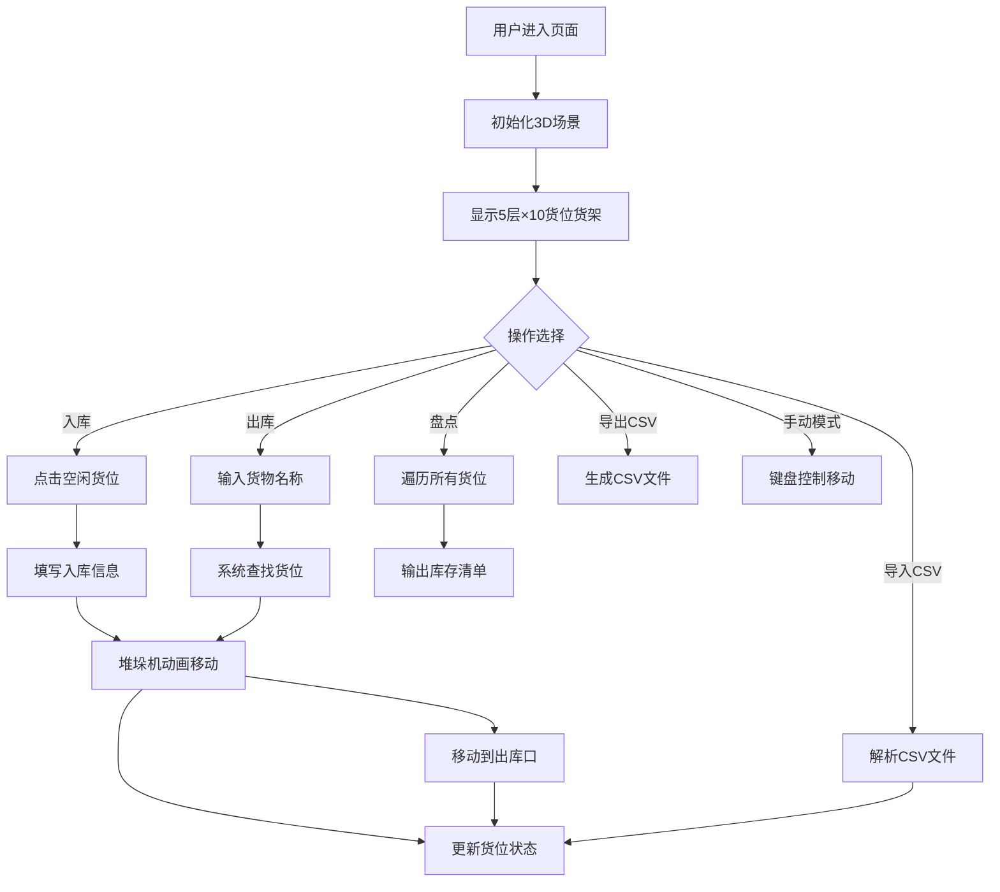

## 1. 产品概述

基于Three.js的3D自动化立体仓库模拟器，用于展示和模拟仓储入库、出库流程。目标用户为物流专业学生、仓储管理人员和自动化系统学习者，提供直观的3D可视化交互体验。

产品价值：通过沉浸式3D交互，帮助用户理解立体仓库的运作原理，直观展示货位管理、堆垛机调度、库存盘点等核心仓储流程。

## 2. 核心功能

### 2.1 用户角色
无需登录注册，所有功能对所有访问者开放。

### 2.2 功能模块
1. **3D场景展示**：立体货架、堆垛机模型、出库口可视化
2. **入库管理**：点击货位入库、信息填写、动画执行
3. **出库管理**：按名称查找、自动调度、出库动画
4. **库存管理**：热力图展示、库存盘点、清单输出
5. **数据管理**：CSV导入初始库存、CSV导出当前库存
6. **操作模式**：自动/手动模式切换、键盘控制堆垛机

### 2.3 页面详情
| 页面名称 | 模块名称 | 功能描述 |
|---------|---------|----------|
| 主页面 | 3D场景画布 | 5层×10货位立体货架展示，支持鼠标旋转、缩放、平移 |
| 主页面 | 顶部控制栏 | 模式切换（自动/手动）、热力图开关、盘点按钮、导入/导出按钮 |
| 主页面 | 右侧信息面板 | 当前模式显示、库存统计、操作日志 |
| 主页面 | 入库弹窗 | 货物名称输入、入库数量输入、确认/取消按钮 |
| 主页面 | 出库弹窗 | 货物名称输入、查找按钮、确认出库按钮 |
| 主页面 | 盘点弹窗 | 库存清单表格、导出按钮 |

## 3. 核心流程

### 3.1 入库流程
用户点击空闲货位 → 弹出入库表单 → 填写货物名称和数量 → 提交 → 堆垛机从原点移动到目标货位 → 放置货物 → 货位变为绿色 → 更新库存记录

### 3.2 出库流程
用户点击出库按钮 → 弹出出库表单 → 输入货物名称 → 系统自动查找货位 → 堆垛机移动到目标货位 → 取出货物 → 移动到出库口 → 货位恢复空闲 → 更新库存记录

### 3.3 盘点流程
用户点击盘点按钮 → 系统遍历所有货位 → 收集已占用货位信息 → 弹窗展示清单表格（货物名称、位置、数量）

### 3.4 Mermaid流程图

## 4. 用户界面设计

### 4.1 设计风格
- **主题色**：深蓝色（#1e3a5f）作为主色调，代表工业科技感
- **辅助色**：橙色（#ff6b35）作为强调色，用于按钮和交互元素
- **货位颜色**：浅灰色（空闲）、绿色渐变（已占用，根据数量深浅变化）
- **按钮风格**：圆角矩形，带悬停动画和点击反馈
- **字体**：使用 'Rajdhani' 作为标题字体（工业科技感），'Noto Sans SC' 作为正文字体
- **布局风格**：左侧3D场景占主要区域，右侧信息面板悬浮布局
- **图标风格**：使用Font Awesome图标，线性风格

### 4.2 页面设计概述
| 页面名称 | 模块名称 | UI元素 |
|---------|---------|--------|
| 主页面 | 3D场景 | 透视相机、环境光+方向光、阴影效果、轨道控制器 |
| 主页面 | 控制栏 | 玻璃拟态效果，固定在顶部，按钮带图标 |
| 主页面 | 信息面板 | 半透明背景，实时更新统计数据 |
| 主页面 | 弹窗 | 居中显示，毛玻璃背景，平滑过渡动画 |
| 主页面 | 表格 | 斑马纹行，悬停高亮，支持滚动 |

### 4.3 响应性
- 桌面端优先设计，主场景自适应窗口大小
- 控制栏在小屏幕转为垂直排列
- 信息面板可折叠收起
- 触摸设备支持手势操作场景

### 4.4 3D场景指导
- **环境**：深灰色渐变背景，模拟仓库内部环境，添加轻微雾效
- **光照**：半球光（环境）+ 2盏方向光（主光+补光），开启阴影投射
- **相机**：初始位置(15, 12, 15)，看向场景中心，限制最大/最小缩放距离
- **组成**：地面（灰色带网格纹理）、货架主体（银色金属质感）、货位（可交互立方体）、堆垛机（工业机械臂模型）、出库口（橙色标识区域）
- **交互**：货位高亮（悬停时）、点击选中动画、堆垛机移动缓动效果
- **动画**：堆垛机移动使用TWEEN.js缓动，货位颜色渐变过渡
- **性能**：货位使用InstancedMesh优化渲染，限制多边形数量
