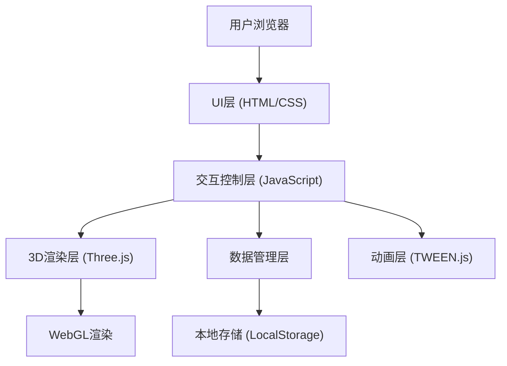
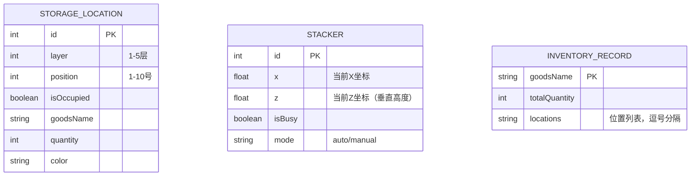

## 1. 架构设计



## 2. 技术描述

- **前端框架**：原生HTML5 + CSS3 + JavaScript ES6+（无需React，项目规模适中且需要精细控制Three.js）
- **3D引擎**：Three.js r160（通过CDN引入）
- **动画库**：TWEEN.js（通过CDN引入，用于堆垛机移动缓动）
- **UI图标**：Font Awesome 6（CDN引入）
- **构建工具**：无需构建，直接使用静态HTML文件
- **数据存储**：浏览器LocalStorage持久化库存数据
- **开发服务器**：Vite（用于本地开发热重载）

## 3. 文件结构

| 文件路径 | 用途 |
|---------|------|
| `index.html` | 主页面，包含场景容器、控制栏、弹窗结构 |
| `css/style.css` | 全局样式、UI组件样式、动画定义 |
| `js/SceneManager.js` | Three.js场景初始化、相机、光照、渲染循环 |
| `js/Shelf.js` | 货架模型创建、货位管理、颜色更新 |
| `js/Stacker.js` | 堆垛机模型、移动动画、货物抓取逻辑 |
| `js/InventoryManager.js` | 库存数据管理、增删改查、CSV导入导出 |
| `js/UIManager.js` | UI交互、弹窗控制、事件绑定 |
| `js/Heatmap.js` | 热力图颜色计算、货位颜色更新 |
| `js/main.js` | 应用入口、初始化所有模块、事件协调 |

## 4. 数据模型

### 4.1 数据模型定义



### 4.2 数据结构示例

```javascript
// 单个货位数据
{
  id: "L2-P5",
  layer: 2,
  position: 5,
  isOccupied: true,
  goodsName: "电子元器件",
  quantity: 100,
  color: "#4caf50"
}

// 库存记录
{
  goodsName: "电子元器件",
  totalQuantity: 250,
  locations: ["L2-P5", "L3-P2"]
}
```

## 5. 核心API（内部模块接口）

### 5.1 SceneManager
```javascript
class SceneManager {
  init(container)    // 初始化场景
  addObject(obj)     // 添加3D对象
  removeObject(obj)  // 移除3D对象
  getIntersects(event)  // 获取射线拾取对象
  animate()          // 渲染循环
}
```

### 5.2 Shelf
```javascript
class Shelf {
  createShelves()    // 创建5层×10货位货架
  getSlot(layer, position)  // 获取指定货位
  updateSlotColor(layer, position, color)  // 更新货位颜色
  getSlotByMesh(mesh)  // 通过mesh对象获取货位数据
  getAllSlots()      // 获取所有货位
}
```

### 5.3 Stacker
```javascript
class Stacker {
  createModel()      // 创建堆垛机模型
  moveTo(x, z)       // 移动到指定位置（动画）
  pickUpGoods()      // 抓取货物
  dropGoods()        // 放置货物
  setMode(mode)      // 设置模式 auto/manual
  manualMove(direction)  // 手动控制移动
}
```

### 5.4 InventoryManager
```javascript
class InventoryManager {
  addGoods(layer, position, name, quantity)  // 入库
  removeGoods(name)        // 出库（按名称查找第一个）
  findGoods(name)          // 查找货物位置
  getInventoryList()       // 获取盘点清单
  importCSV(file)          // 导入CSV
  exportCSV()              // 导出CSV
  saveToStorage()          // 保存到LocalStorage
  loadFromStorage()        // 从LocalStorage加载
}
```

## 6. 关键技术实现

### 6.1 堆垛机移动动画
使用TWEEN.js实现缓动动画，先水平移动X轴到位，再垂直移动Z轴到位，模拟真实堆垛机运行逻辑。

### 6.2 货位交互检测
使用Three.js Raycaster进行射线拾取，检测用户点击的货位，结合pointer事件实现悬停高亮效果。

### 6.3 热力图算法
根据货物数量计算颜色深度：
- 0件：浅灰色 #e0e0e0
- 1-50件：浅绿色 #c8e6c9
- 51-100件：中绿色 #81c784
- 101-200件：深绿色 #4caf50
- 200件以上：最深色 #2e7d32

### 6.4 CSV解析
使用原生JavaScript解析CSV，支持标准格式：
```csv
layer,position,goodsName,quantity
1,1,电子元器件,100
1,2,机械零件,50
```

### 6.5 键盘控制
监听keydown事件，在手动模式下：
- W/S：Z轴上下移动
- A/D：X轴左右移动
